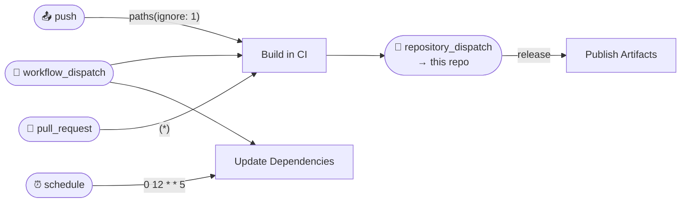

# Workflows

```mermaid
flowchart LR
    workflowdispatch(["👤 workflow_dispatch"])
    push(["📤 push"])
    pullrequest(["🔀 pull_request"])
    schedule(["⏰ schedule"])
    repositorydispatchgithubrepository(["🔔 repository_dispatch<br/>→ this repo"])
    buildyml["Build in CI"]
    uploadreleaseyml["Publish Artifacts"]
    updatedependenciesyml["Update Dependencies"]
    workflowdispatch --> buildyml
    workflowdispatch --> updatedependenciesyml
    push -->|"paths(ignore: 1)"|buildyml
    pullrequest -->|"(*)"|buildyml
    schedule -->|"0 12 * * 5"|updatedependenciesyml
    buildyml --> repositorydispatchgithubrepository
    repositorydispatchgithubrepository -->|"release"|uploadreleaseyml
```

## Workflows

- [Build in CI](./build/)
- [Update Dependencies](./update-dependencies/)
- [Publish Artifacts](./upload-release/)